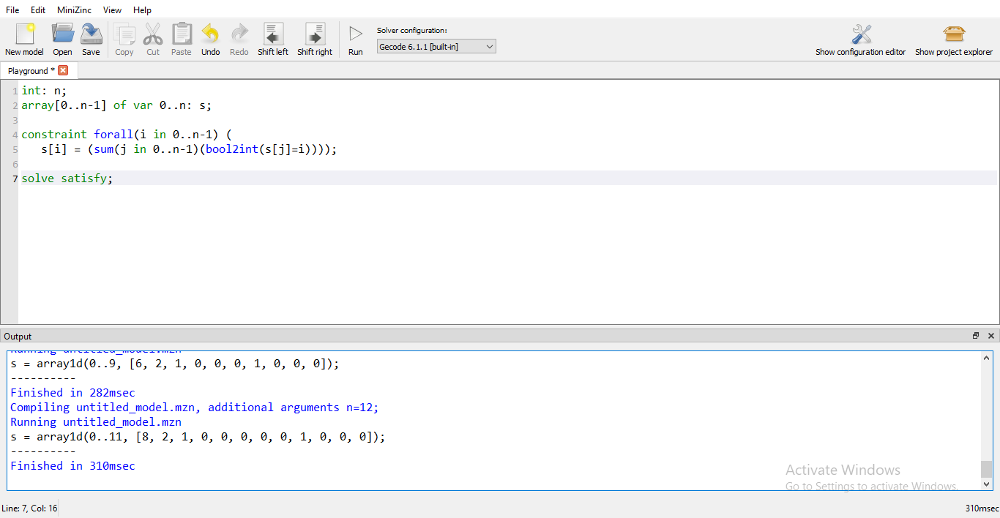

# MinizincTest

MiniZinc can be used for model constraint satisfaction and optimization problems in a high-level, solver-independent way, taking advantage of a large library of pre-defined constraints

## The Repo for Easy Task for Minizinc Examples

### Task Name

#### (a) Install MiniZinc on your computer and run some of the examples, for example from the Handbook or the examples pages;

#### (b) Study a bit of the MiniZinc modeling language and formulate and solve an example of your own. How will the R input and output look like?

I solved  the various exmaple given in the Minizinc Handbook.

